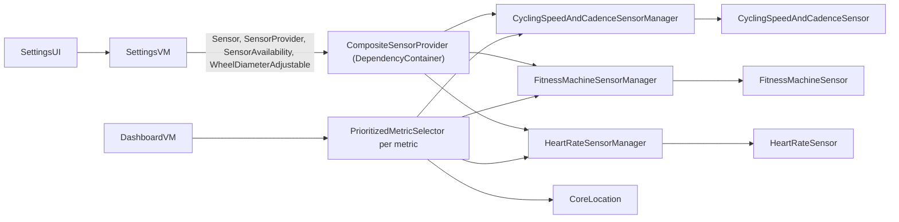
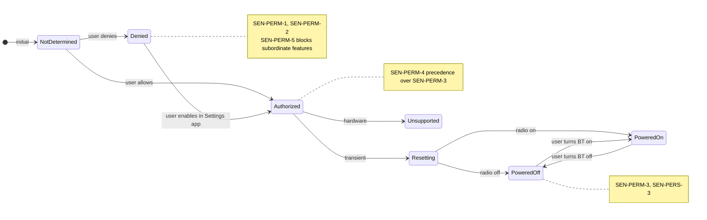
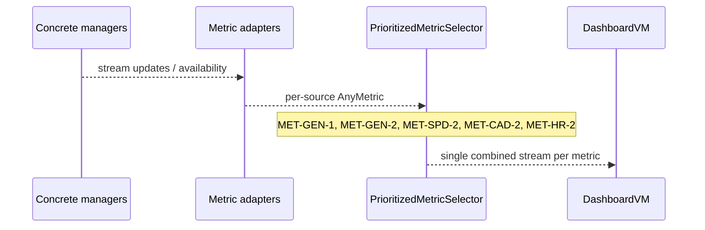

# Sensors — Architecture Overview

This document describes the **target** architecture for Bluetooth sensors, Settings UI, persistence, and metric publication in Biker. It complements the software requirements in [docs/srs/Sensors.md](../srs/Sensors.md). **Authoritative API shapes** for protocols and value types will live in Swift source under the appropriate local packages once implemented; this doc names them and points to ADRs for rationale.

## Related ADRs

| ADR | Title |
|-----|--------|
| [0001](../adr/0001-modularizing-app-local-swift-packages.md) | Modularizing the app with local Swift packages |
| [0002](../adr/0002-per-sensor-capability-protocols.md) | Per-sensor-type capability protocols |
| [0003](../adr/0003-cycling-speed-and-cadence-sensor-as-first-class-type.md) | `CyclingSpeedAndCadenceSensor` as a first-class type |
| [0004](../adr/0004-composite-sensor-provider-at-composition-root.md) | `CompositeSensorProvider` at the composition root |
| [0005](../adr/0005-per-manager-persistence-stores.md) | Per-manager persistence stores |
| [0006](../adr/0006-metric-source-selection-at-app-level.md) | Metric source selection at the app level |
| [0007](../adr/0007-bluetooth-availability-as-first-class-state.md) | `BluetoothAvailability` as first-class state (superseded) |
| [0009](../adr/0009-sensor-availability-sum-type.md) | `SensorAvailability` sum type and system-wide radio state |
| [0008](../adr/0008-no-singletons-for-sensor-managers.md) | No singletons for sensor managers |

## Module map

- **SettingsUI** — SwiftUI; depends on `SettingsVM` and `DesignSystem`.
- **SettingsVM** — Defines `Sensor`, `SensorProvider`, `SensorAvailability` (sum type wrapping a provider when the system radio allows sensor use), optional capability protocols (e.g. `WheelDiameterAdjustable`), and the raw `BluetoothAvailability` type used only in composition. No imports of sensor implementation packages (per [local package independence](../../.cursor/rules/package-independence.mdc)).
- **DependencyContainer** — Constructs managers, the composite provider, metric adapters, and `PrioritizedMetricSelector` wiring.
- **Per-type packages** — `CyclingSpeedAndCadenceService` (or successor), FTMS package, Heart Rate package: each owns BLE for that family, persistence for that family, and exposes metrics to `DependencyContainer`.

## Ownership

| Concern | Owner |
|--------|--------|
| `CBCentralManager` (per radio / per manager design) | Each `*SensorManager` in its package |
| `CBPeripheral`, GATT for that family | Corresponding `*Sensor` instance ([ADR-0003](../adr/0003-cycling-speed-and-cadence-sensor-as-first-class-type.md)) |
| Stateless BLE payload parse (e.g. CSC Measurement bytes) | Stateless types/enums in the package (e.g. `CSCMeasurementParser`) |
| Delta math (speed, cadence, wheel distance from successive samples) | Per-sensor calculator on the sensor instance (e.g. `CSCDeltaCalculator`) |
| User-editable wheel diameter (CSCS only) | `CyclingSpeedAndCadenceSensor` + persistence ([ADR-0005](../adr/0005-per-manager-persistence-stores.md), [ADR-0002](../adr/0002-per-sensor-capability-protocols.md)) |
| Known-sensor list merge, scan ordering | `CompositeSensorProvider` ([ADR-0004](../adr/0004-composite-sensor-provider-at-composition-root.md)) |
| Cross-type metric priority (CSC vs FTMS vs GPS, etc.) | `PrioritizedMetricSelector` in app composition ([ADR-0006](../adr/0006-metric-source-selection-at-app-level.md)) |
| Bluetooth permission vs power vs UI gating | `AnyPublisher<SensorAvailability, Never>` at `SettingsViewModel` + one system `BluetoothAvailability` source at the composition root ([ADR-0009](../adr/0009-sensor-availability-sum-type.md)) |
| Object lifetime / wiring | `DependencyContainer` ([ADR-0008](../adr/0008-no-singletons-for-sensor-managers.md)) |

## Key protocols (pointers)

These will be defined in Swift (target TBD, likely `SettingsVM` for consumer-facing abstractions):

- `Sensor` — identity, human-readable name, `SensorType`, connection state, enabled state, connect/disconnect/forget.
- `SensorProvider` — merged known and discovered streams, scan control; **only** reachable inside `SensorAvailability.available` for Settings.
- `SensorAvailability` — sum of non-ready radio/permission cases plus `case available(any SensorProvider)` ([ADR-0009](../adr/0009-sensor-availability-sum-type.md)).
- `WheelDiameterAdjustable: Sensor` — wheel diameter stream and setter; only CSC sensors conform ([ADR-0002](../adr/0002-per-sensor-capability-protocols.md)).
- `BluetoothAvailability` — raw state mapped from `CBCentralManager` for the composition root; not exposed in parallel on `SensorProvider` ([ADR-0009](../adr/0009-sensor-availability-sum-type.md)).

The Swift files are the source of truth for exact signatures.

## Bluetooth permission and power state

Core Bluetooth exposes **authorization** (permission) and **central manager state** (including powered off, resetting, unsupported). The app maps these to a single `BluetoothAvailability` stream for Settings so the UI can satisfy [SEN-PERM-1](../srs/Sensors.md) through [SEN-PERM-5](../srs/Sensors.md) and drive auto-reconnect behavior per [SEN-PERS-2](../srs/Sensors.md)–[SEN-PERS-4](../srs/Sensors.md).

**Behavioral summary (normative requirements live in the SRS):**

- **Permission not granted** — Replace Sensors section with permission message; no scan, no known list ([SEN-PERM-1](../srs/Sensors.md)). Revocation while running: stop scan, treat all as disconnected, same UI ([SEN-PERM-2](../srs/Sensors.md)).
- **Permission granted, radio off** — Section visible, scan disabled, all known rows disconnected, BT-off indication, no auto-connect ([SEN-PERM-3](../srs/Sensors.md)).
- **Permission message** takes precedence over BT-off indication ([SEN-PERM-4](../srs/Sensors.md)).
- **Subordinate sections** of the SRS (Known, Scan, Details, Persistence) are conditional on permission ([SEN-PERM-5](../srs/Sensors.md)).

## Metric source selection

Cross-type priority and ties are specified in [ADR-0006](../adr/0006-metric-source-selection-at-app-level.md). At a high level, each `*SensorManager` (and Core Location) contributes `AnyMetric<…>` adapters; `DependencyContainer` runs one `PrioritizedMetricSelector` per metric kind.

Publishing cadence [MET-GEN-3](../srs/Sensors.md) is met by combining selector output with a tick or by ensuring sources produce at least 1 Hz while active; implementation detail belongs in `CoreLogic` / `DependencyContainer`.

## Persistence (summary)

| Store owner | Key contents (per known sensor) | ADR |
|-------------|--------------------------------|-----|
| CSC manager / store | id, name, type, enabled, wheel diameter | [0005](../adr/0005-per-manager-persistence-stores.md) |
| FTMS manager / store | id, name, type, enabled | [0005](../adr/0005-per-manager-persistence-stores.md) |
| HR manager / store | id, name, type, enabled | [0005](../adr/0005-per-manager-persistence-stores.md) |

## Threading and actor isolation

All sensor managers and UI view models that touch Core Bluetooth are expected to be **`@MainActor`**-isolated, matching current project patterns. Revisit if profiling shows a need for background queues for parsing only (stateless parse can move off the main actor later without changing the architecture doc).

## Testing strategy

- **SettingsVM** — Mock `SensorProvider` and `any Sensor` (including `any WheelDiameterAdjustable`) for list, scan, and details behavior.
- **Per-type managers** — Inject a test double or protocol abstraction for the central/scan side; unit-test ordering, connect/disconnect, and persistence in isolation.
- **DependencyContainer (integration)** — Wire real managers in a test host or a narrow integration test: composite ordering, selector priority, and availability reduction.

## SRS traceability

Each `SEN-*` / `MET-*` id from [Sensors.md](../srs/Sensors.md) maps to the overview section(s) and/or ADR(s) that carry the design. *Implementation* is tracked in code and tests.

| ID | Design coverage |
|----|-----------------|
| SEN-MAIN-1 | [Module map](#module-map); SettingsUI (implementation) |
| SEN-MAIN-2 | [Module map](#module-map); [ADR-0004](../adr/0004-composite-sensor-provider-at-composition-root.md) (scan) |
| SEN-MAIN-3 | [Module map](#module-map); [ADR-0004](../adr/0004-composite-sensor-provider-at-composition-root.md) (known list) |
| SEN-PERM-1 | [Bluetooth permission and power state](#bluetooth-permission-and-power-state); [ADR-0007](../adr/0007-bluetooth-availability-as-first-class-state.md) |
| SEN-PERM-2 | [Bluetooth permission and power state](#bluetooth-permission-and-power-state); [ADR-0007](../adr/0007-bluetooth-availability-as-first-class-state.md) |
| SEN-PERM-3 | [Bluetooth permission and power state](#bluetooth-permission-and-power-state); [ADR-0007](../adr/0007-bluetooth-availability-as-first-class-state.md) |
| SEN-PERM-4 | [Bluetooth permission and power state](#bluetooth-permission-and-power-state) |
| SEN-PERM-5 | [Bluetooth permission and power state](#bluetooth-permission-and-power-state) |
| SEN-KNOWN-1 | [Key protocols (pointers)](#key-protocols-pointers); [ADR-0003](../adr/0003-cycling-speed-and-cadence-sensor-as-first-class-type.md), [ADR-0004](../adr/0004-composite-sensor-provider-at-composition-root.md), [ADR-0005](../adr/0005-per-manager-persistence-stores.md) |
| SEN-KNOWN-2 | [Ownership](#ownership); [ADR-0003](../adr/0003-cycling-speed-and-cadence-sensor-as-first-class-type.md) |
| SEN-KNOWN-3 | [Key protocols (pointers)](#key-protocols-pointers); [ADR-0003](../adr/0003-cycling-speed-and-cadence-sensor-as-first-class-type.md), [ADR-0005](../adr/0005-per-manager-persistence-stores.md) |
| SEN-KNOWN-4 | [Key protocols (pointers)](#key-protocols-pointers); [ADR-0003](../adr/0003-cycling-speed-and-cadence-sensor-as-first-class-type.md) |
| SEN-KNOWN-5 | [Key protocols (pointers)](#key-protocols-pointers); [ADR-0007](../adr/0007-bluetooth-availability-as-first-class-state.md) |
| SEN-KNOWN-6 | [Key protocols (pointers)](#key-protocols-pointers); [ADR-0004](../adr/0004-composite-sensor-provider-at-composition-root.md) (type + state on each row) |
| SEN-KNOWN-7 | [Key protocols (pointers)](#key-protocols-pointers); [ADR-0003](../adr/0003-cycling-speed-and-cadence-sensor-as-first-class-type.md) |
| SEN-KNOWN-8 | [ADR-0002](../adr/0002-per-sensor-capability-protocols.md), [ADR-0003](../adr/0003-cycling-speed-and-cadence-sensor-as-first-class-type.md), [ADR-0005](../adr/0005-per-manager-persistence-stores.md) |
| SEN-KNOWN-9 | [ADR-0005](../adr/0005-per-manager-persistence-stores.md) (default in CSC schema) |
| SEN-KNOWN-10 | [ADR-0002](../adr/0002-per-sensor-capability-protocols.md), [ADR-0003](../adr/0003-cycling-speed-and-cadence-sensor-as-first-class-type.md), [ADR-0006](../adr/0006-metric-source-selection-at-app-level.md) (wheel diameter not applied outside CSC speed/distance path) |
| SEN-SCAN-1 | SettingsUI; [ADR-0004](../adr/0004-composite-sensor-provider-at-composition-root.md) |
| SEN-SCAN-2 | [ADR-0004](../adr/0004-composite-sensor-provider-at-composition-root.md) (scan stop on dismiss) |
| SEN-SCAN-3 | [ADR-0004](../adr/0004-composite-sensor-provider-at-composition-root.md), [ADR-0007](../adr/0007-bluetooth-availability-as-first-class-state.md) (stop on permission/power loss) |
| SEN-SCAN-4 | [Module map](#module-map); [ADR-0004](../adr/0004-composite-sensor-provider-at-composition-root.md) (fan-out scan) |
| SEN-SCAN-5 | [ADR-0004](../adr/0004-composite-sensor-provider-at-composition-root.md) (merged discovered list) |
| SEN-SCAN-6 | [Key protocols (pointers)](#key-protocols-pointers); [ADR-0004](../adr/0004-composite-sensor-provider-at-composition-root.md) |
| SEN-SCAN-7 | [ADR-0004](../adr/0004-composite-sensor-provider-at-composition-root.md) (ordering) |
| SEN-SCAN-8 | [ADR-0004](../adr/0004-composite-sensor-provider-at-composition-root.md) (stable sort triggers) |
| SEN-SCAN-9 | [Key protocols (pointers)](#key-protocols-pointers); [Ownership](#ownership) |
| SEN-SCAN-10 | [Key protocols (pointers)](#key-protocols-pointers); [Ownership](#ownership) |
| SEN-SCAN-11 | [ADR-0004](../adr/0004-composite-sensor-provider-at-composition-root.md), [ADR-0005](../adr/0005-per-manager-persistence-stores.md) (persist + default enabled) |
| SEN-DET-1 | SettingsUI; [Key protocols (pointers)](#key-protocols-pointers) |
| SEN-DET-2 | SettingsUI; [Key protocols (pointers)](#key-protocols-pointers) |
| SEN-DET-3 | SettingsUI; [Key protocols (pointers)](#key-protocols-pointers) |
| SEN-DET-4 | SettingsUI |
| SEN-DET-5 | [ADR-0002](../adr/0002-per-sensor-capability-protocols.md), [ADR-0003](../adr/0003-cycling-speed-and-cadence-sensor-as-first-class-type.md) |
| SEN-DET-6 | [ADR-0002](../adr/0002-per-sensor-capability-protocols.md), [ADR-0003](../adr/0003-cycling-speed-and-cadence-sensor-as-first-class-type.md), [ADR-0006](../adr/0006-metric-source-selection-at-app-level.md) |
| SEN-TYP-1 | [Module map](#module-map); [ADR-0001](../adr/0001-modularizing-app-local-swift-packages.md) (local package boundaries) |
| SEN-TYP-2 | [ADR-0003](../adr/0003-cycling-speed-and-cadence-sensor-as-first-class-type.md), [ADR-0006](../adr/0006-metric-source-selection-at-app-level.md) |
| SEN-TYP-3 | [ADR-0006](../adr/0006-metric-source-selection-at-app-level.md) |
| SEN-TYP-4 | [ADR-0003](../adr/0003-cycling-speed-and-cadence-sensor-as-first-class-type.md) |
| SEN-TYP-5 | [ADR-0003](../adr/0003-cycling-speed-and-cadence-sensor-as-first-class-type.md) |
| SEN-PERS-1 | [Persistence (summary)](#persistence-summary); [ADR-0005](../adr/0005-per-manager-persistence-stores.md) |
| SEN-PERS-2 | [ADR-0005](../adr/0005-per-manager-persistence-stores.md), [ADR-0007](../adr/0007-bluetooth-availability-as-first-class-state.md) |
| SEN-PERS-3 | [ADR-0005](../adr/0005-per-manager-persistence-stores.md), [ADR-0007](../adr/0007-bluetooth-availability-as-first-class-state.md) |
| SEN-PERS-4 | [ADR-0007](../adr/0007-bluetooth-availability-as-first-class-state.md) (permission → granted) |
| SEN-PERS-5 | [Key protocols (pointers)](#key-protocols-pointers); [ADR-0005](../adr/0005-per-manager-persistence-stores.md) |
| MET-GEN-1 | [Metric source selection](#metric-source-selection); [ADR-0006](../adr/0006-metric-source-selection-at-app-level.md) |
| MET-GEN-2 | [ADR-0006](../adr/0006-metric-source-selection-at-app-level.md) (priority + tie-break) |
| MET-GEN-3 | [Metric source selection](#metric-source-selection); [ADR-0006](../adr/0006-metric-source-selection-at-app-level.md) (1 Hz) |
| MET-SPD-1 | [Module map](#module-map); [ADR-0006](../adr/0006-metric-source-selection-at-app-level.md) |
| MET-SPD-2 | [ADR-0006](../adr/0006-metric-source-selection-at-app-level.md) |
| MET-SPD-3 | [ADR-0006](../adr/0006-metric-source-selection-at-app-level.md) |
| MET-SPD-4 | [ADR-0002](../adr/0002-per-sensor-capability-protocols.md), [ADR-0003](../adr/0003-cycling-speed-and-cadence-sensor-as-first-class-type.md), [ADR-0005](../adr/0005-per-manager-persistence-stores.md), [ADR-0006](../adr/0006-metric-source-selection-at-app-level.md) |
| MET-CAD-1 | [ADR-0006](../adr/0006-metric-source-selection-at-app-level.md) |
| MET-CAD-2 | [ADR-0006](../adr/0006-metric-source-selection-at-app-level.md) |
| MET-CAD-3 | [ADR-0006](../adr/0006-metric-source-selection-at-app-level.md) |
| MET-HR-1 | [ADR-0006](../adr/0006-metric-source-selection-at-app-level.md) |
| MET-HR-2 | [ADR-0006](../adr/0006-metric-source-selection-at-app-level.md) |
| MET-HR-3 | [ADR-0006](../adr/0006-metric-source-selection-at-app-level.md) |

> **Composition:** [ADR-0008](../adr/0008-no-singletons-for-sensor-managers.md) applies to how managers and the composite are constructed; it is left implicit in many rows.

## Automated integration coverage (Biker scheme)

The **`DependencyContainerIntegrationTests`** target (in `Biker`’s Test action) exercises the composition root and Lex adapters with in-memory persistences and **fake `CSCCentral` / `FTMSCentral` / `HRCentral`** (see `local packages/DependencyContainer/Tests/DependencyContainerIntegrationTests/`). Integration tests **avoid a real** `CBCentralManager` where a fake is injected: Core Bluetooth can otherwise reorder or defer delivery relative to `CSCPeripheralLexMetrics` / `FTMSPeripheralLexMetrics` rebind/ingest.

| Area | Test suite or method |
|------|----------------------|
| Composite, SEN-SCAN-7/8, scan fan-out | `SensorStackCompositionIntegrationTests` |
| Availability merge (most restrictive) | `combinedAvailability_deniedBeatsPoweredOn` |
| Reconnect / disabled skip | `ftms_reconnectsDisconnectedKnownOnPowerOn`, `ftms_reconnectSkipsWhenKnownDisabled` |
| Persistence + legacy CSC migration | `settingsPersistence_roundTripCSCWheel_durableAcrossRecomposition`, `legacyKnownSensors_migratesToCscStoreInLiveComposition` |
| ADR-0006, MET-GEN-2/3, SEN-TYP-5, HR | `MetricSelectionIntegrationTests` |

Settings-only UI (e.g. SEN-DET-4) remains in **`SettingsVMTests`**.

### Illustrative SRS ↔ test pointers

| SRS | Where exercised |
|-----|-----------------|
| MET-GEN-2, MET-SPD-*, MET-CAD-* | `MetricSelection (integration)` suite |
| MET-GEN-3 | `metGen3_tickRepeatsCurrentSpeedAtLeastOncePerTickWhileActive` |
| SEN-TYP-5 | `prefersDualCapableForSpeedAndCadenceOverLexFirstWheelOnly` |
| SEN-DET-4 | `SensorsSectionViewModelTests` |
